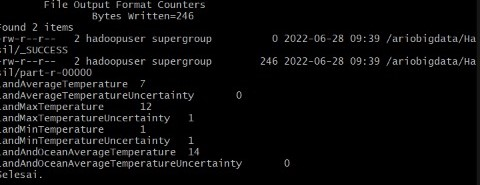

 
## Case : Change Climate ##

Ariono Septian Jaya
1941720092 / TI-3H / 04

### Source Dataset
Dataset diambil dari Kaggle.com pada [link](https://www.kaggle.com/datasets/berkeleyearth/climate-change-earth-surface-temperature-data) ini.

### Link Video Presentasi
Video presentasi, saya sertakan pada [link](https://youtu.be/g4GF9WA7mu8) berikut.

### Mapper
so in the code here the mapping is carried out after the input is done and occurs in temperature conditioning with the temperature code cannot be equal to 0
if(temperature.compareTo("Temperature") != 0){
             context.write(new Text(id), new Text(temperature));

### Reducer 
reducer here will return data that has been mapped to bring up new data, namely the average calculation with the total formula divided by the number of data in the public void reduce code where if the value is less than 6 using the value calculation, the sum will be done and the final result is the total divided with the amount of data that has been calculated in the if function with code result.set(sum / n) .After that the data will be displayed according to what has been reduced earlier.

### Output #
Run Job : 
File_jar : used to send the processed target file.jar to the target folder
Hadoop_username = Our hadoop root name
Ip = ip main data on our server.
Home_Dir : In order to be able to enter data easily into the Hadoop root server
Jar name = the name of the target file that we want to export to the target file.
INPUT_Folder = folder inside hadoop root that we have created
OUTPUT : folder inside hadoop root that we have created

the output will be like that (Average) , so execution will be rate from total already college devide by many of data.

